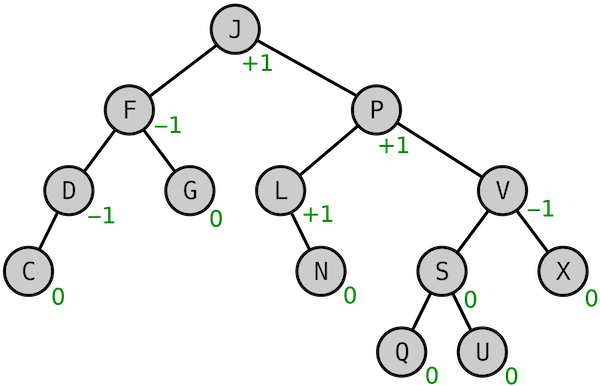

#  AVL-Tree

In computer science, an AVL tree (named after inventors Adelson-Velsky and Landis) is a self-balancing binary search tree.
It was the first such data structure to be invented. In an AVL tree, the heights of the two child subtrees of any node differ by at most one;
if at any time they differ by more than one, re-balancing is done to restore this property.
Lookup, insertion, and deletion all take `O(log n)` time in both the average and worst cases, where `n` is the number of nodes in the tree prior to the operation.
Insertions and deletions may require the tree to be rebalanced by one or more tree rotations.

    

