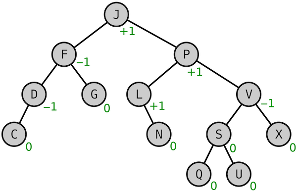

#  AVL-Tree

### Abstract
An AVL tree, named after its inventors Adelson-Velsky and Landis, was the first self-balancing binary search tree to be invented. The heights of the two child subtrees of any node differ by at most one, and whenever an insertion or a deletion breaks that property the tree restores it with one or more rotations. Staying balanced is what keeps lookup, insertion and deletion at `O(log n)` in both the average and the worst case, where `n` is the number of nodes in the tree.

This repository is a self-contained implementation in Java, with no external dependencies. It stores `String` keys and supports insertion, deletion, search and depth queries, rebalancing itself after every update through the four standard rotation cases, and it can print the tree in both in-order and pre-order traversals. `Main.java` is a short demo that builds a tree of names and exercises each operation.

    

#### To use this work on your researches or projects you need:
* Java (JDK 8 or higher)

#

#### To install Java:
_First, check if you already have it installed or not_.
~~~~
javac -version
~~~~
_If you don't have a JDK on your computer you can use the code below_:
~~~~
sudo apt-get update
sudo apt-get install default-jdk
~~~~
#

#### To compile and run this project:
_From the root of the repository_:
~~~~
cd Source
javac *.java
java Main
~~~~
#
